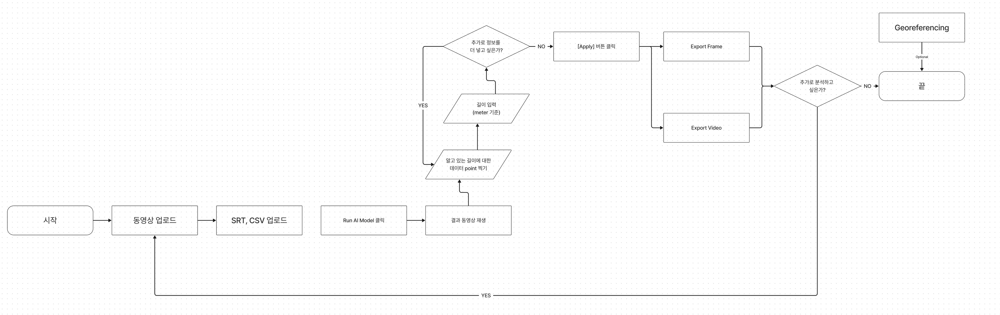

# DVA 백엔드

## 프로젝트 개요
DVA 백엔드는 해상에서 선박과 돌고래 사이의 거리를 계산하고 시각화하는 역할을 합니다. 프론트엔드에서 전송된 비디오 파일과 사용자 입력값을 처리하여 MSA(Microservice Architecture) 구조로 구성된 여러 모델의 추론 결과를 기반으로 실제 거리를 시각화한 영상을 재구성하고, 이를 프론트엔드로 전송합니다.


## 기술 스택
- **언어**: Python 3.10
- **웹 프레임워크**: FastAPI
- **비동기 서버 게이트웨이 인터페이스 (ASGI)**: Uvicorn
- **컨테이너화**: Docker (TBA)
- **영상 처리**: OpenCV

## 시작하기
이 섹션에서는 로컬 개발 환경에서 DVA 백엔드를 설정하고 실행하는 방법을 설명합니다.

### 설치
```bash
# 저장소를 클론합니다.
git clone [저장소 URL]

# 프로젝트 디렉토리로 이동합니다.
cd backend

# 필요한 Python 패키지를 설치합니다.
pip install -r requirements.txt
```

### 환경 설정
환경변수 및 구성 설정을 위한 .env 파일을 생성하고 예제에 맞게 수정합니다.
```text
# 예시 .env 파일
VIDEO_PATH=/path/to/video
MODEL_ENDPOINT=http://model-service
```

### 실행
```bash
# Uvicorn을 사용하여 애플리케이션을 실행합니다.
uvicorn main:app --reload
```

## 사용방법
DVA 백엔드는 프론트엔드와 통신하기 위한 RESTful API를 제공합니다. 이 서버를 사용하여 비디오 파일을 업로드하고 처리 결과를 받을 수 있습니다.

### 비디오 파일 전송
비디오 파일을 서버에 업로드하려면, 다음 curl 명령어를 사용합니다:
```bash
curl -X POST "http://localhost:8000/video/" \
     -H "accept: application/json" \
     -H "Content-Type: multipart/form-data" \
     -F "file=@/path/to/your/video.mp4"
```
* 파일은 backend 서버의 test_video 폴더 안에 저장됩니다.

### 포인트 거리 정보 전송
영상에서 특정 포인트 2개와 그 사이의 실제 거리 정보를 서버로 보내려면 아래 curl 명령어를 사용하세요:
```bash
curl -X POST "http://localhost:8000/points-distance/" \
     -H "Content-Type: application/json" \
     -d '{"point1": {"x": 100, "y": 150}, "point2": {"x": 200, "y": 150}, "distance": 5.0}'
```

### 처리된 영상 가져오기
서버에서 영상 처리가 완료되면, 처리된 영상을 다운로드하기 위한 curl 명령어는 다음과 같습니다:
```bash
curl -X GET "http://localhost:8000/processed-videos/{video_id}"

```

### 응답과 오류 코드
* 200 OK: 요청이 성공적일 때 반환됩니다. 파일 업로드 및 처리된 영상 다운로드에 대한 응답입니다.
* 500 Internal Server Error: 서버 오류 발생 시 반환됩니다. 상세 정보는 서버 로그를 통해 확인할 수 있습니다.

## 문서화
FastAPI는 자동으로 API 문서를 생성합니다. 아래 링크에서 실행 중인 애플리케이션의 API 문서를 볼 수 있습니다.
Swagger UI: http://localhost:8000/docs
