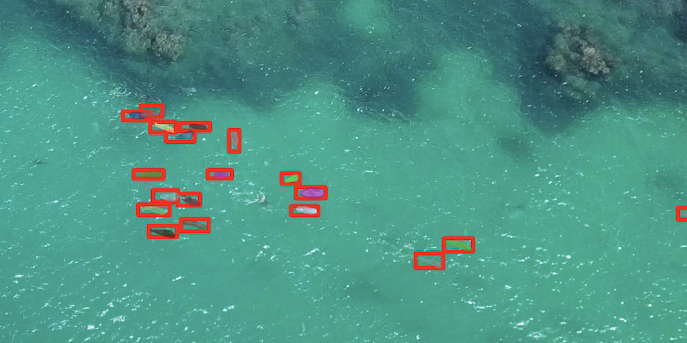

# Segmentation
SAM 및 SAM-HQ 사용을 위한 클래스

## 1. 예시 사용
```python
from segment import Segment
import cv2

sample_img = "sample.jpg"
sample_bboxes = [
    [75, 275, 1725, 850],
    [425, 600, 700, 875],
    [1375, 550, 1650, 800],
    [1240, 675, 1400, 750],
]
segment = Segment("cpu")
img = cv2.imread(sample_img)
masks = segment.do_seg(img, sample_bboxes)
# segment.show_mask(masks, random_color=True) # mask만 보고 싶을 때
segment.show_mask_bbox(masks, sample_bboxes, random_color=True)
```

## 2. 주의사항
* 이미지는 RGB 형태로 입력해야 함
* 배치 구현은 하지 않음
* bbox는 [[x1, y1, x2, y2], ...] 형태로 모든 값이 정수여야 함
* segment 이미지 저장은 검증 목적으로 원본 이미지의 해상도를 유지 하지 않음

## 3. Sample 결과



## TODO
* TODO@jh: SAM-HQ 옵션 추가 (https://drive.google.com/file/d/1qobFYrI4eyIANfBSmYcGuWRaSIXfMOQ8/view?usp=sharing)


